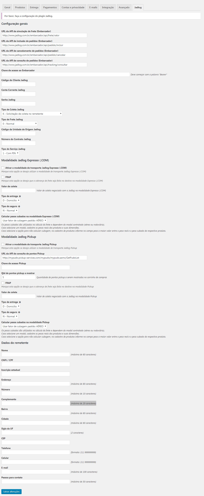
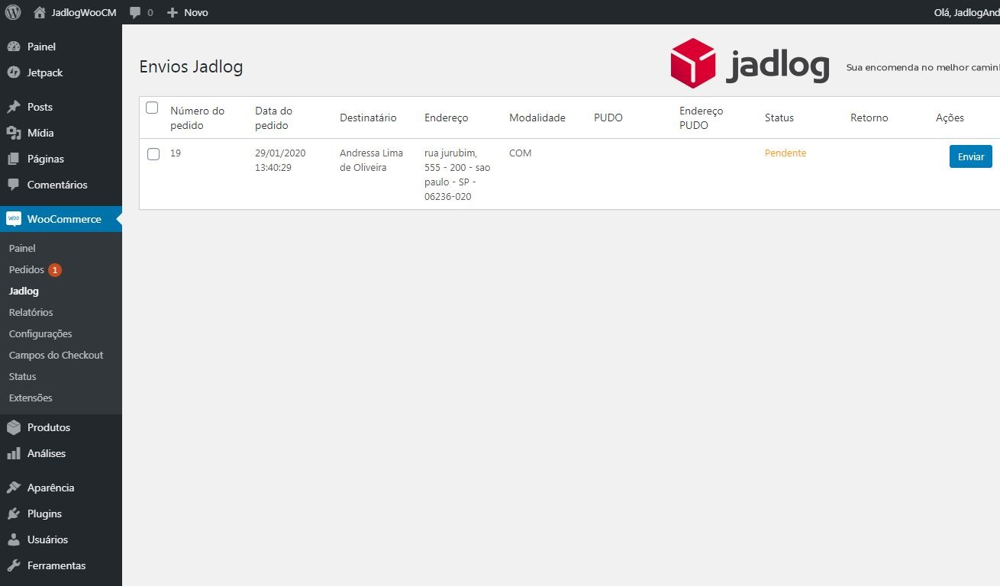
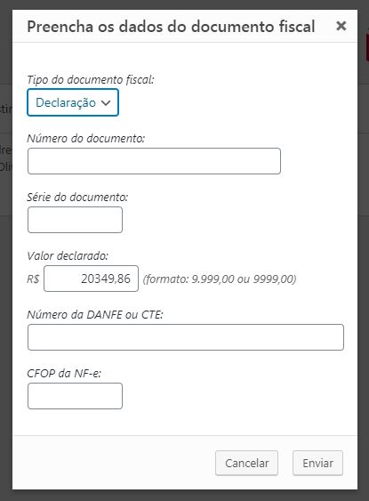
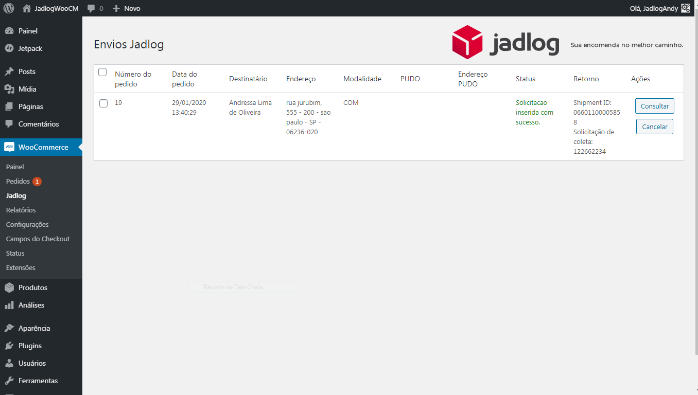

[//]: # (To view this file use: python -m pip install --user grip; python -m grip -b "Jadlog - Magento.md")
[//]: # (https://github.com/settings/tokens)
[//]: # (vim ~/.grip/settings.py)
[//]: # (PASSWORD = 'YOUR-ACCESS-TOKEN')
[//]: # (https://github.com/naokazuterada/MarkdownTOC)
[//]: # (Many thanks to peek for animated gif generation: https://github.com/phw/peek)

# Módulo de Frete Jadlog - WooCommerce

!!! _**Versão BETA**_ !!!

## Conteúdo
<!-- MarkdownTOC -->

- Configuração
  - Parâmetros iniciais
    - Configuração Geral
    - Modalidade Jadlog Expresso \(.COM\)
    - Modalidade Jadlog Pickup
    - Dados do Remetente \(Loja\)
- Utilização pelos clientes
  - Escolha do ponto de retirada
  - Enviar solicitação de coleta
  - Preencher dados fiscais
  - Rastreamento
- Desenvolvimento

<!-- /MarkdownTOC -->

## Configuração

### Parâmetros iniciais
Para configurar os parâmetros iniciais do módulo acesse a configuração a partir do menu *WooCommerce -> Configuration*, aba *Jadlog*.
Há quatro seções distintas.
- Configuração Geral
- Modalidade Jadlog Expresso
- Modalidade Jadlog Pickup
- Dados do Remetente (Loja)

#### Configuração Geral

- **URL da API de simulação de frete (Embarcador)**:  
Endereço para cotação do frete.  
Valor padrão: http://www.jadlog.com.br/embarcador/api/frete/valor

- **URL da API de inclusão de pedidos (Embarcador)**:  
Endereço para envio do pedido de coleta.  
Valor padrão: http://www.jadlog.com.br/embarcador/api/pedido/incluir

- **URL da API de cancelamento de pedidos (Embarcador)**: 
Endereço para cancelamento do pedido.  
Valor padrão: http://www.jadlog.com.br/embarcador/api/pedido/cancelar

- **URL da API de consulta de pedidos (Embarcador)**:  
Endereço para rastreamento do pedido.  
Valor padrão: http://www.jadlog.com.br/embarcador/api/tracking/consultar

- **Token**:  
Token de autorização fornecido pela Jadlog após a assinatura do contrato  
O token deve ser preenchido no formato *Bearer xYz1234.xYz1234.xYz1234*. É importante manter a palavra *Bearer* seguida por *espaço* e a sequência correta de caracteres.

- **Código do Cliente Jadlog**:  
Código do Cliente fornecido pela Jadlog após a assinatura do contrato.

- **Conta Corrente Jadlog**:  
Conta corrente fornecida pela Jadlog após a assinatura do contrato.

- **Senha Jadlog**:  
Senha fornecida pela Jadlog após a assinatura do contrato.

- **Tipo de Coleta Jadlog**:  
Tipo de Coleta Jadlog fornecido pela Jadlog após a assinatura do contrato.

- **Tipo de Frete Jadlog**:  
Tipo de Frete Jadlog fornecido pela Jadlog após a assinatura do contrato.

- **Código da Unidade de Origem Jadlog**:  
Código da Unidade de Origem Jadlog fornecido pela Jadlog após a assinatura do contrato.

- **Número do contrato**:  
Número de contrato fornecido pela Jadlog após a assinatura do contrato.

- **Tipo do Serviço Jadlog**:  
Tipo de Serviço fornecido pela Jadlog após a assinatura do contrato.

#### Modalidade Jadlog Expresso (.COM)

- **Ativar a modalidade de transporte Jadlog Expresso (.COM)**:  
Marque esta opção se deseja utilizar a modalidade de transporte Jadlog Expresso (.COM)

- **FRAP**:  
Marque esta opção se deseja que a cobrança de frete seja feita no destino na modalidade Expresso (.COM)

- **Valor de Coleta**:  
Valor de coleta negociado com a Jadlog na modalidade Expresso (.COM)

- **Tipo de Entrega**: 
 Tipo de entrega fornecido pela Jadlog após a assinatura do contrato.

- **Tipo do Seguro**:  
 Tipo do seguro fornecido pela Jadlog após a assinatura do contrato.

- **Calcular pesos cubados na modalidade Expresso (.COM)**:  
Usar fator de cubagem padrão: AÉREO

#### Modalidade Jadlog Pickup

- **Ativar a modalidade de transporte Jadlog Pickup**:  
Marque esta opção para ativar a modalidade de transporte Jadlog Pickup

- **URL da API de consulta de pontos Pickup**:  
Endereço para consulta dos pontos de retirada (pickup).  
Valor padrão: *http://mypudo.pickup-services.com/mypudo/mypudo.asmx/GetPudoList*

- **Chave de acesso Pickup**:  
Chave do serviço de consulta de pontos de coleta fornecida pela Jadlog após a assinatura do contrato.

- **Qtd de pontos pickup a mostrar**:  
Quantidade de pontos pickup a serem mostrados no carrinho de compras

- **FRAP**:  
Marque esta opção se deseja que a cobrança de frete seja feita no destino na modalidade Pickup.

- **Tipo de Entrega**:  
 Tipo de entrega fornecido pela Jadlog após a assinatura do contrato.

- **Tipo do Seguro**:  
 Tipo do seguro fornecido pela Jadlog após a assinatura do contrato.

- **Calcular pesos cubados na modalidade Pickup**:  
Usar fator de cubagem padrão: AÉREO

#### Dados do Remetente (Loja)

- **Nome**:  
Nome da loja.

- **CNPJ**:  
Preencher com o CNPJ da loja (somente números sem pontuação).

- **Inscrição estadual**:  
Número da inscrição estadual da loja. Preencher somente com números ou, caso não possua, preencher com a palavra *isento*.

- **Endereço (tipo e logradouro)**:  
Endereço da loja. Preencher com o tipo e nome do logradouro.

- **Número**:  
Número do endereço da loja.

- **Complemento**:  
Complemento do endereço da loja.

- **Bairro**:  
Bairro da loja.

- **Cidade**:  
Cidade da loja.

- **Sigla da UF**:  
UF da loja (informar a sigla com dois caracteres).

- **CEP**:  
CEP da loja (somente números).

- **Telefone (fixo)**:  
Número do telefone fixo da loja.

- **Celular**:  
Número do telefone celular da loja.

- **Email**:  
Email do contato da loja.

- **Pessoa para contato**:  
Nome do Responsável da loja.

## Utilização pelos clientes

### Escolha do ponto de retirada
Caso o cliente escolha como forma de entrega a modalidade "Jadlog - Retire em um ponto Pickup" ele terá a oportunidade de escolher um ponto de retirada próximo ao endereço que ele preencheu no cadastro.

### Enviar solicitação de coleta

### Preencher dados fiscais
Acessar *WooCommerce -> Jadlog*  
Os dados fiscais do pedido são informados da seguinte forma:

- Tipo de Documento Fiscal  
Preencher de acordo com o tipo de documento fiscal:  
  - Declaração
  - Nota Fiscal - NF
  - Nota Fiscal Eletrônica - NF-e
  - Conhecimento de Transporte Eletrônico - CT-e  

- Número do Documento  
Número do documento fiscal. Caso não exista preencher como *DECLARACAO*.

- Série do Documento:  
Série do documento fiscal. Caso não exista mantenha vazio.

- Valor Declarado:
O valor declarado por padrao é o valor do pedido. Caso desejado você pode alterar. 

- Número da DANFE ou CTE: 
Número do DANFE (Documento Auxiliar da Nota Fiscal Eletrônica). Caso não exista mantenha vazio.
Número do CTE (Conhecimento de Transporte Eletrônico). Caso não exista mantenha vazio.

- CFOP da NF-e:  
Código Fiscal de Operações e Prestações (CFOP).

### Rastreamento
Pode ser feito diretamente pelo site da Jadlog ou pelo no Botão *Consultar*  
  
*O botão CANCELAR tem a função de cancelar o envio do pedido*

## Desenvolvimento

* [Jadlog](http://www.jadlog.com.br) - *Uma empresa DPDgroup*